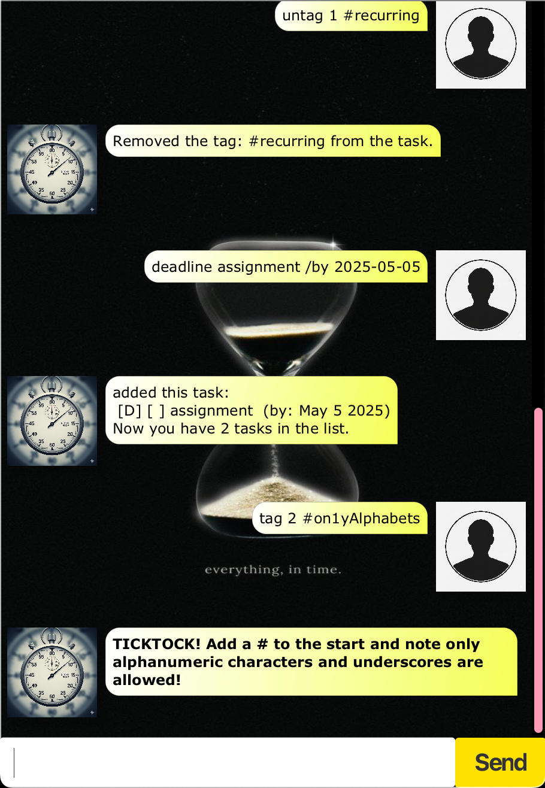

# Kronos User Guide

## Adding tasks
Adds a task to the list, currently there are 3 types of
supported tasks.

> _Task descriptions can be multiple words._

### todo
This is a task with just a description.

Format: `todo <description>`

### deadline
This is a task with a completion date.

Format: `deadline <description> \by YYYY-MM-DD`

### event
This is a task with a beginning and an end date.

Format: `event <description> \from YYYY-MM-DD \to YYYY-MM-DD`

## Deletion of tasks: `delete`
Deletes the task

Format: `delete <task_number>`

## Listing: `list`
Shows a list of all tasks

Format: `list` 

## Exiting the program: `bye`
Exits the program and saves all tasks

Format: `bye` 

## Finding tasks
Searches for all tasks that contains the search term

Format: `find <search_term>`

## Tagging
Tags a task with up to 3 tags. You can add up to 3 at one time.

> _Each Tag must start with a # and only be alphabets_

Good examples : #health, #work, #SelfCare  
Bad examples : #Gam1ng, #CS2103T

> _Elements with <?> may be omitted when typing the command_

Format: `tag <task_number> <tag_1> <?tag_2> <?tag_3>`

## Untagging
Removes either a tag or all tags from a task.

> _Type the tag out in full with the #. To clear all, use #ADD._

Format: `tag <task_number> <tag>`